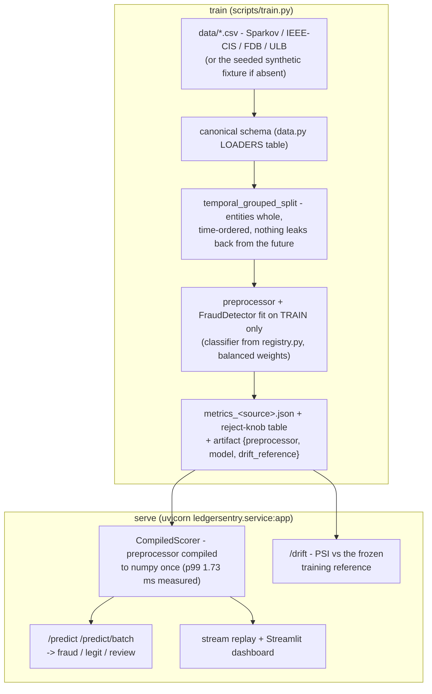

# LedgerSentry

Real-time financial-transaction fraud detection with a tunable reject-to-review option.
A gradient-boosted classifier that scores each transaction and, when it isn't confident
either way, abstains and returns `"review"` instead of guessing. It is the FlowSentry
architecture (my real-time network-intrusion-detection flagship) retargeted from network
flows to financial transactions: same reject-option idea, same leakage-safe evaluation
discipline, same honesty rules, different domain.

**The 90-second version:**

- **Real result:** PR-AUC **0.7278, 95% CI [0.6214, 0.8232]** on the ULB
  credit-card fraud set (284,807 real anonymized transactions, 492 fraud, 0.17%)
  with a strictly temporal holdout - train on the first ~40 hours, test on the last
  ~7.6 hours, nothing from the future leaks back. No-skill baseline on that fold is
  0.0013, so that is roughly a 550x lift. **The interval is published because the
  fold has 75 frauds and 75 positives do not earn four decimals** - it is measured
  (1000-resample bootstrap, committed), not hedged with a disclaimer.
- **The knob is the product:** fully automated it catches **63 of 75 test frauds
  (84% recall)** and 29% of its flags are truly fraud; send the most uncertain 7.1% of
  traffic to human review and the automated flags become **89.8% precise**. The full
  measured coverage / precision / recall table is below.
- **Calibrated when it counts:** the raw score is a good ranker and a bad probability
  (measured: Brier worse than predicting the base rate). A Platt map fit on a
  train-only slice cuts test-fold Brier 4.2x without moving PR-AUC a bit, so a fraud
  desk can set the review threshold by expected cost. Isotonic was measured too, and
  rejected for damaging ranking - the numbers for both are committed.
- **Fast enough to sit inline:** single-row scoring p99 **1.73 ms** measured against a
  stated 10 ms budget, with a committed benchmark harness, a profile-driven
  optimization (before: 5.50 ms), and a CI test that fails if it regresses.
- **Everything reproduces:** pinned deps, `make reproduce` retrains on the real data
  and fails unless the metrics match the committed file **byte for byte**. Without the
  data file, the same pipeline runs a deterministic synthetic fixture so tests and CI
  stay green offline; real and synthetic numbers are never mixed (`is_synthetic` tag).

## Money boundary

This is fraud-**detection** software and research only. No trading, no moving money, no
personalized financial advice, anywhere in this repo.

## Why the usual approach on this dataset is wrong

The ULB set is the most-used fraud dataset there is, and most results on it are broken
the same three ways:

1. **Accuracy on 99.9%-legit data.** On this repo's own test fold, predicting
   "legit" every single time scores **99.87%** accuracy and catches zero of the 75
   frauds. This repo's actual model scores **99.71%**, which is *worse than doing
   nothing* - measured, committed, and published rather than hidden, because our own
   model failing the metric is the best possible proof that accuracy measures the
   imbalance and not the model. Every "99.9% accurate" fraud notebook is reporting
   the base rate back as an achievement. The honest headline at this imbalance is
   **PR-AUC against its own no-skill baseline** (0.0013 here), plus the operating
   table. And ROC-AUC misleads more subtly: on these identical predictions it reads
   **0.9740** against PR-AUC's 0.7278, because its no-skill baseline is 0.5 at any
   imbalance and 56,886 easy negatives swamp its false-positive rate. All three
   numbers are committed under `demoted_metrics` and pinned by `verify_repro.py` -
   demoted, never headline. [ADR 002](docs/adr/002-pr-auc-not-accuracy.md).
2. **Shuffled splits.** A random split trains on Tuesday's fraud to predict Monday's,
   and grades the model on cards it already memorized. Fraud is adversarial and
   non-stationary; the only split that predicts deployment is a temporal one, entities
   kept whole. That is why this repo's 0.73 is not comparable to shuffled-split 0.86s,
   and refuses to be. [ADR 001](docs/adr/001-temporal-grouped-split.md).
3. **A forced binary answer.** Real fraud operations run three outcomes, not two -
   auto-clear, auto-flag, human review - and their actual daily decision is how much
   review capacity buys how much precision. The model here abstains below a confidence
   bar, and the deliverable is the measured coverage/precision/recall table over that
   bar, not one number. [ADR 003](docs/adr/003-reject-to-review-knob.md).

The differentiation of this repo is not the dataset (nothing could be), it is the
rigor: the strict temporal holdout, the metric that cannot lie at this base rate, the
reject knob a fraud team actually operates, measured calibration, measured latency,
and byte-identical reproduction of every committed number.

## Architecture



Full picture with all three seams and the module map: [`docs/architecture.md`](docs/architecture.md).
The load-bearing decisions each have a short ADR in [`docs/adr/`](docs/adr): why this split
(001), why PR-AUC (002), why a reject option (003), what was deliberately NOT built (004),
the compiled scorer (005), calibration (006), the headline's confidence intervals (007),
decoupling the reject knob's two cuts (008), and comparing feature sets and boosting
configs without cheating the holdout (009).

## Results on real data (ULB credit-card fraud, measured 2026-07-15)

Dataset: ULB "Credit Card Fraud Detection" - 284,807 real anonymized European card
transactions over 2 days, 492 fraud (0.173%). ULB publishes no card/customer id, so
the grouped split degrades (documented in `data.py`) to a **pure temporal split**:
227,846 train rows (417 fraud) / 56,961 test rows (75 fraud, 0.132%) - the model is
evaluated only on the final ~7.6 hours of transactions it has never seen.

**PR-AUC on the real imbalanced holdout: 0.7278, 95% CI [0.6214, 0.8232]**
(no-skill baseline on this fold: 0.0013, roughly a 550x lift). Published
XGBoost-class numbers on real card data run ~0.86-0.88, but on random
(non-temporal) splits of different datasets - not directly comparable, and not
claimed to be. See `docs/model_card.md` for the full honesty notes. Source of
truth: `artifacts/metrics_ulb_creditcard.json` (`is_synthetic: false`).

**Uncertainty, published beside the number instead of disclaimed.** The fold holds
75 frauds, so the headline gets an interval: PR-AUC **[0.6214, 0.8232]** and recall
**[0.75, 0.9167]**, from a seeded 1000-resample percentile bootstrap
(`python scripts/bootstrap.py` -> `artifacts/bootstrap_ulb_creditcard.json`). The
recall interval is cross-checked against a closed-form Wilson interval computed
independently, **[0.7408, 0.9060]**, and they agree to about a point at each end.
What that buys: the conclusion "far better than no-skill" is safe (the interval's
floor is still ~480x the baseline), and any argument resting on the decimals is
not. One extra caught fraud moves recall 1.33 points. The interval covers sampling
noise only, not fold-choice variance - rolling-origin evaluation is the fix for
that and is still an open gap below.

**Coverage vs precision AND recall on real data (the reject-to-review knob working).**
The test fold has **75 frauds**; "caught / queue / missed" shows how each threshold
splits them into auto-flagged, routed-to-human-review, and auto-cleared-as-legit
(the only true misses). Recall (auto) = caught / 75.

| Review threshold | Coverage | Sent to review | Flagged fraud | Precision on flagged | Fraud caught / queue / missed | Recall (auto) |
|---|---|---|---|---|---|---|
| 0.50 | 100.00% | 0 | 216 | 29.17% | 63 / 0 / 12 | 84.0% |
| 0.70 | 99.45% | 312 | 129 | 44.19% | 57 / 9 / 9 | 76.0% |
| 0.80 | 98.98% | 583 | 105 | 53.33% | 56 / 10 / 9 | 74.7% |
| 0.90 | 97.22% | 1,582 | 73 | 73.97% | 54 / 13 / 8 | 72.0% |
| 0.95 | 92.91% | 4,039 | 59 | 89.83% | 53 / 16 / 6 | 70.7% |

Reading it: fully automated the model catches **63 of 75 frauds (84% recall)** and 29%
of its flags are truly fraud. Route the most uncertain 7.1% of traffic to review
(threshold 0.95) and the automated flags become **89.8% precise** - and note the misses
actually *drop* from 12 to 6, because the extra uncertain frauds go to the review queue
(16 of them) instead of being auto-cleared. So at 0.95, 69 of 75 frauds are surfaced
(auto-flag + review) and only 6 slip through. That precision lift for a bounded
human-review budget, with recall stated honestly beside it, is the product. (Above 0.95
the uncalibrated confidence cliff sends almost everything to review - measured, shown in
the model card's full 8-row table, and called out as a limitation rather than hidden.)

### Synthetic fixture (offline CI baseline, labeled synthetic)

With no real file in `data/`, the same pipeline runs a deterministic seeded fixture
(8,000 rows, ~1% fraud) so tests and CI are green with zero downloads: PR-AUC
**0.7884** against a 0.0095 no-skill baseline (`artifacts/metrics_synthetic.json`,
`is_synthetic: true`). Full table and caveats in `docs/model_card.md` - synthetic
numbers are a pipeline proof, not a benchmark claim, and are never mixed with the
real ones.

### Continuing work: booster head-to-head and SHAP attribution (measured 2026-07-21)

Two additions since the headline run, both committed as artifacts and neither
retrofitted into the headline, which stays exactly as shipped.

**LightGBM beats the incumbent on this fold, and the headline is not being
quietly swapped.** `python scripts/compare_boosters.py` runs LightGBM through
the exact `compare.py` machinery (same temporal holdout, selection on the inner
validation slice only, paired bootstrap on the delta) against the shipped
`hist_gbdt` config (`artifacts/comparison_boosters_ulb_creditcard.json`).
Validation picks `lgbm_slow` (400 rounds, lr 0.05): test PR-AUC **0.8081** vs
the incumbent's 0.7278, paired delta **+0.0804, 95% CI [0.0239, 0.1379]**,
winning 99.8% of resamples - an interval that excludes zero, unlike the velocity
null above. At the incumbent's exact budget (200 rounds, lr 0.1, matched 31-leaf
capacity), `lgbm_default` posts +0.0635 but its interval [-0.0003, 0.1240] still
grazes zero. The identity check passed: the rebuilt incumbent lands on the
committed CI [0.6214, 0.8232] exactly. The headline stays 0.7278 on purpose:
promoting LightGBM means a compiled optional wheel in the serving path and a
retrain of every committed artifact, and that migration should be its own
change, made with this artifact as the evidence - not a side effect of measuring.

**The model's fraud signal, attributed.** `python scripts/shap_report.py` runs
exact TreeExplainer attribution on the shipped `ledgersentry.joblib` over all
56,961 test rows (`artifacts/shap_ulb_creditcard.json` + a summary beeswarm PNG),
additivity checked against the model's own margin (max error < 1e-14, committed).
Globally `f_V14` leads (mean |SHAP| 0.1381); on the 75 fraud rows the evidence
concentrates hard in four PCA components - **V14 (+3.10 log-odds on average),
V12, V4, V10** - which matches what the literature reports for tree models on
ULB. Honest limits: the units are log-odds, not probability points, and on ULB
the top features are anonymized components, so this is proof of method and of
what the model keys on, not reason codes a human could act on. Per-decision
reason codes at `/predict` remain an open gap below.

## Measured latency and throughput

Fraud scoring is only "real-time" if it fits inside payment authorization, where the
whole round-trip is budgeted in tens to a few hundred milliseconds and the risk check
gets a slice. This repo holds itself to an explicit engineering target - **single-row
scoring p99 under 10 ms on commodity hardware** (our own bar, not an industry-published
figure) - and measures against it with a committed harness instead of asserting it:
`python scripts/bench.py`, results in `artifacts/benchmark.json` with the exact
environment recorded.

Measured on the real ULB artifact and its 56,961-row held-out test split (this
machine, single-thread, no GPU, 2026-07-16):

| Path | mean | p50 | p95 | p99 | throughput |
|---|---|---|---|---|---|
| single-row, pandas (before) | 4.13 ms | 3.98 ms | 4.93 ms | 5.50 ms | 242 rows/s |
| single-row, compiled (after) | **1.02 ms** | 1.04 ms | 1.39 ms | **1.73 ms** | 985 rows/s |
| batch, pandas | - | - | - | - | 605,569 rows/s |
| batch, compiled | - | - | - | - | 662,976 rows/s |

Numbers are the committed `artifacts/benchmark.json` run, quoted exactly. Run-to-run
OS noise is real: across repeat runs on this machine the pandas path's p99 ranged
5.5-10.1 ms (straddling the budget), the compiled path's 1.4-2.4 ms (never near it).

Profiling showed single-row scoring spending ~two thirds of its time in
pandas/`ColumnTransformer` machinery on a 1-row frame, not in the model. The fix
(`scoring.py`) compiles the fitted preprocessor once - one-hot category maps and
numeric column order - and builds the model's input matrix directly in numpy per
request. Same model, same numbers: tests pin the compiled transform byte-exact to the
`ColumnTransformer` output, decisions included, and a latency-regression test fails CI
if per-row pandas work creeps back in. The before path is kept in the repo
(`PandasScorer`) as the reference implementation and benchmark baseline. Read the
batch rows honestly: at volume the `ColumnTransformer` amortizes fine, so the compiled
path buys latency on the request path, not batch throughput.

The streaming replay (`python scripts/stream.py --n 0`) replays the held-out test
split one row at a time through the same compiled scorer the service uses and prints
its own measured percentiles.

## Quickstart

```bash
git clone <this repo, once published>
cd ledgersentry
python -m venv .venv
source .venv/bin/activate        # Windows: .venv\Scripts\activate
pip install -r requirements.txt
pip install -e .                 # optional - scripts/train.py works without it

python scripts/train.py          # no data file present -> synthetic fixture (offline)
                                  # writes artifacts/ledgersentry.joblib + metrics.json
pytest                           # run the test suite (127 tests)
ruff check .                     # lint
mypy                             # type-check src/

# reproduce the REAL ULB numbers (one public file, no login):
curl -o data/creditcard.csv https://storage.googleapis.com/download.tensorflow.org/data/creditcard.csv
python scripts/train.py          # detects the file, trains + evaluates on real data
python scripts/verify_repro.py   # FAILS unless the regenerated metrics are byte-identical
                                  # to the committed artifacts/metrics_ulb_creditcard.json
# (same thing as one target: make reproduce)

python scripts/calibrate.py      # the calibration pipeline -> calibration_<source>.json
python scripts/bench.py          # the latency/throughput benchmark -> benchmark.json
python scripts/bootstrap.py      # 95% CIs on the headline -> bootstrap_<source>.json
python scripts/compare.py        # feature-set x boosting-config comparison, selected
                                  # on an inner validation slice -> comparison_<source>.json
python scripts/cost.py           # expected cost per review threshold, illustrative
                                  # cost triples -> expected_cost_curve_<source>.json

# optional analysis extras (lightgbm + shap; see requirements-analysis.txt for
# why shap installs --no-deps):
make install-analysis
python scripts/compare_boosters.py  # lightgbm vs the incumbent, paired bootstrap
                                     # -> comparison_boosters_<source>.json
python scripts/shap_report.py       # SHAP attribution on the shipped artifact
                                     # -> shap_<source>.json + shap_summary_<source>.png
```

Config: defaults are exactly the committed run; override with `LEDGERSENTRY_*` env vars
or a `ledgersentry.yaml` (see `ledgersentry.example.yaml`). A typo'd option is a loud
error, not a silent no-op.

## Serving + dashboard

Requires `artifacts/ledgersentry.joblib` to exist first - run `python scripts/train.py`
(above) at least once.

```bash
# FastAPI service: /health, /ready, /predict, /predict/batch, /drift, /curve
uvicorn ledgersentry.service:app --app-dir src --reload
# in another shell:
curl -X POST http://127.0.0.1:8000/predict \
  -H "Content-Type: application/json" \
  -d '{"features": {"amount": 420.85, "category": "travel", "timestamp": "2026-03-04T02:11:00"}, "review_threshold": 0.9}'

# Streaming replay: real per-row latency, printed at the end (see "Measured latency" above)
python scripts/stream.py --n 0

# Streamlit dashboard: review-threshold slider, live coverage/precision, live feed
streamlit run dashboard/app.py

# Or both services in one container stack (api:8000, dashboard:8501):
# (honesty note: the image has not been build-tested - Docker was unavailable
#  on the build machine)
docker compose up --build
```

`/predict` derives its expected input columns from the FITTED preprocessor inside the
loaded artifact (not a hardcoded schema), so it isn't locked to the synthetic fixture's
columns - swap in a real dataset (see "Data" below), retrain, and the same endpoint
serves whatever `f_*` features that source produced. Missing numeric fields default to
NaN (which the gradient-boosted model handles natively - not a misleading fake 0.0),
missing `category` defaults to `"unknown"`, and the response lists any imputed fields
under `missing_fields`.

## Data

`src/ledgersentry/data.py` is dataset-agnostic: drop a real file in `data/` and
`load()` uses it automatically instead of the synthetic fallback. No dataset is
committed to or downloaded by this repo - fetching is a manual step. All four loaders
are exercised in CI against tiny true-schema fixture CSVs (`tests/test_loaders.py`),
so a loader regression turns CI red without shipping any real data.

| Source | Why | Drop it at | Get it from |
|---|---|---|---|
| **ULB Credit Card Fraud** | classic baseline, the real-data run above - 284,807 European transactions, 492 fraud | `data/creditcard.csv` | no login needed: `curl -o data/creditcard.csv https://storage.googleapis.com/download.tensorflow.org/data/creditcard.csv` (TensorFlow's hosted copy of the [Kaggle set](https://www.kaggle.com/mlg-ulb/creditcardfraud); verify 284,807 rows / 492 fraud after download) |
| **Sparkov** (kartik2112, Kaggle) | streaming/real-time demo - has genuine timestamps, 1.85M simulated transactions, 1,000 customers x 800 merchants | `data/fraudTrain.csv` [+ `fraudTest.csv`] | [kaggle.com/datasets/kartik2112/fraud-detection](https://www.kaggle.com/datasets/kartik2112/fraud-detection) (Kaggle login) |
| **IEEE-CIS Fraud Detection** (Vesta) | headline benchmark - 590,540 real e-commerce transactions, 393 features | `data/train_transaction.csv` [+ `train_identity.csv`] | [kaggle.com/c/ieee-fraud-detection](https://www.kaggle.com/c/ieee-fraud-detection) (Kaggle login) |
| **Amazon `fraud-dataset-benchmark`** | comparability - a standardized multi-dataset benchmark harness | `data/fdb_train.csv` [+ `fdb_test.csv`] (export `obj.train.to_csv(...)` yourself; the package has no file-export of its own) | [github.com/amazon-science/fraud-dataset-benchmark](https://github.com/amazon-science/fraud-dataset-benchmark) |

## Repository layout

```
src/ledgersentry/
  config.py      pydantic-settings: env > yaml > defaults (defaults = the committed run)
  data.py        canonical schema, LOADERS spec table, synthetic fixture, the split
  registry.py    model registry: hist_gbdt (default) + shallow/deep variants +
                 logreg baseline + optional lgbm; one register() call to add
                 a classifier
  model.py       FraudDetector + reject knob + curve / expected-cost math
  velocity.py    rolling velocity/aggregate features (count/sum/mean over time
                 windows, stream-level + per-entity); opt-in, not in the headline
  compare.py     feature-set x boosting-config comparison on the same holdout,
                 selected on an inner validation slice (ADR 009)
  compare_boosters.py  LightGBM vs the incumbent through the same machinery;
                 needs the optional install (requirements-analysis.txt)
  shap_report.py exact TreeExplainer attribution on the shipped artifact;
                 optional install, explains, never trains
  cost.py        expected cost per review threshold on the calibrated knob,
                 priced under illustrative cost triples
  scoring.py     TransactionScorer protocol: CompiledScorer (serving) + PandasScorer
                 (reference + benchmark baseline), pinned equal by tests
  train.py       load -> split -> fit -> evaluate -> artifacts (+ drift reference)
  calibration.py Platt/isotonic calibration pipeline, separate from train (ADR 006)
  bootstrap.py   95% CIs on the headline (percentile bootstrap + a Wilson
                 cross-check), its own pipeline for the same reason (ADR 007)
  drift.py       per-feature PSI vs the training reference frozen in the artifact
  bench.py       latency/throughput harness -> artifacts/benchmark.json
  service.py     FastAPI: /predict, /predict/batch, /drift, /health, /ready, /curve
  stream.py      timestamp-ordered replay of the held-out test split
dashboard/app.py Streamlit: review-threshold slider, live coverage/precision, feed
scripts/         thin CLI entry points (train, stream, calibrate, bootstrap,
                 compare, compare_boosters, shap_report, cost, bench,
                 verify_repro)
tests/           determinism, split leakage, reject knob, all four loaders
                 (true-schema fixtures), compiled-vs-reference scoring parity, latency
                 regression guard, calibration monotonicity, bootstrap determinism +
                 a hand-computed Wilson interval, velocity causality, paired-delta
                 comparison, expected-cost accounting, drift, API behavior
docs/
  model_card.md    full measured results (real + synthetic, clearly separated) + limits
  architecture.md  both pipelines, the three seams, the module map (mermaid)
  threat_model.md  trust boundaries, the artifact-is-code rule, what deployment owns
  adr/             the nine load-bearing decisions, rejected alternatives named
artifacts/       committed, per-source: metrics_*.json, calibration_*.json,
                 bootstrap_*.json, benchmark_*.json, comparison_*.json,
                 shap_*.json (+ *.json = latest run);
                 ledgersentry.joblib gitignored
Makefile         install / test / lint / train / reproduce / bench / serve / dashboard
Dockerfile / docker-compose.yml   one image, two services (api:8000, dashboard:8501)
```

## Roadmap

**Offline baseline (done)**
- [x] Dataset-agnostic loader: real sources when present, deterministic synthetic
      fallback otherwise
- [x] Leakage-safe grouped + approximately-temporal split, `entity_id` excluded from
      features
- [x] Baseline `FraudDetector` (HistGradientBoostingClassifier, balanced sample
      weights), reject-to-review knob, coverage-vs-precision curve
- [x] PR-AUC (not accuracy) reported against its own random-baseline for context
- [x] Tests (determinism, no group leakage, PR-AUC range, reject-knob behavior) + CI
      (ruff + mypy + pytest + synthetic train/calibrate/bench smoke runs)

**Streaming demo + dashboard (done)**
- [x] `/predict` FastAPI endpoint: score a transaction, review threshold as a request
      parameter; expected columns read off the fitted preprocessor, not hardcoded to
      the synthetic schema
- [x] Replay the held-out test split in timestamp order -> scorer -> live feed, with
      measured latency (replays whatever source is in data/ - ULB here - and labels
      it honestly)
- [x] Dashboard with the review-threshold knob as a live slider (coverage vs precision,
      live)
- [x] Dockerfile + docker-compose (not yet build-tested - Docker was unavailable on
      the build machine; flagged below)

**Real-data run (ULB done)**
- [x] Train and report on real data: ULB credit-card fraud, 284,807 transactions,
      temporal holdout, PR-AUC 0.7278 - reported beside the synthetic-fixture
      numbers, never silently swapped in for them
- [x] CI tests for all four real-dataset loaders (tiny true-schema fixtures in
      `tests/fixtures/`), including a regression test for the FDB amount-column
      mapping

**Hardening**
- [x] Confidence calibration: Platt scaling fit on a temporally-later train-only
      slice; Brier 0.002188 -> 0.000516 on the untouched test fold, ranking
      untouched. Isotonic measured beside it and rejected for damaging PR-AUC
      (ties). Full numbers + the expected-cost tie-in: `docs/model_card.md`
- [x] Committed latency/throughput benchmark with a regression guard (above)
- [x] Drift monitoring: per-feature PSI against a training reference frozen into
      the artifact, served at `POST /drift` (marginals + null-spikes; honest
      about what it cannot see - `src/ledgersentry/drift.py`)
- [x] Threat model: trust boundaries, the artifact-is-code rule, what is
      deliberately left to deployment - `docs/threat_model.md`
- [x] 95% confidence intervals on the headline: seeded percentile bootstrap plus
      an independent Wilson cross-check on recall, published beside the point
      estimate rather than in a footnote. PR-AUC [0.6214, 0.8232], recall
      [0.75, 0.9167] - `docs/adr/007-bootstrap-confidence-intervals.md`
- [x] Reject knob with its two cuts decoupled: explicit `(flag_at, clear_at)`
      operating points beside the symmetric sweep, which one threshold could not
      express. Measured payoff on ULB: same 58 flags at the same 87.93%
      precision as symmetric t=0.5, with auto-cleared frauds cut from 24 to 15 -
      `docs/adr/008-decoupled-reject-knob.md`
- [x] Velocity / aggregate features (`velocity.py`): rolling count/sum/mean of
      amount over 1min/5min/1h/24h plus the inter-transaction gap, stream-level
      and per-entity. Compared against the base set across four boosting configs
      on the same holdout, selected on an inner validation slice
      (`python scripts/compare.py` -> `artifacts/comparison_ulb_creditcard.json`).
      Result on ULB is negative and kept: velocity **hurt** the default config
      (paired delta -0.0119 PR-AUC, 95% CI [-0.0251, -0.0001]), because ULB has no
      card id so the per-entity family degenerates and the V1..V28 components
      already carry the stream-level signal. The headline stays base-features-only.
- [x] Expected cost curve committed (`python scripts/cost.py` ->
      `artifacts/expected_cost_curve_ulb_creditcard.json`): expected dollar cost
      per review threshold on the calibrated knob, priced under three illustrative
      cost triples so the optimum's dependence on the assumptions is visible.
      Turns the previously-deleted, unsourced cost figures into a reproducible
      artifact. Costs stay required arguments with no defaults.
- [x] Booster head-to-head: LightGBM through the same comparison machinery
      (`scripts/compare_boosters.py` ->
      `artifacts/comparison_boosters_ulb_creditcard.json`). Validation-selected
      `lgbm_slow` beats the incumbent, paired delta +0.0804 PR-AUC, 95% CI
      [0.0239, 0.1379]; the headline model is deliberately NOT swapped - see
      "Continuing work" above for why
- [x] Global SHAP attribution on the shipped artifact
      (`scripts/shap_report.py` -> `artifacts/shap_ulb_creditcard.json` + PNG):
      exact TreeExplainer over the full test fold, additivity pinned, global and
      fraud-rows-only top-15 rankings committed

**Open (honest gaps)**
- [ ] Sparkov full run (the streaming story) and IEEE-CIS full run (the headline
      benchmark) - both Kaggle-gated downloads
- [ ] Docker image build-test (Docker unavailable on the build machine)
- [ ] Rolling-origin (multi-fold temporal) evaluation - the committed bootstrap
      captures sampling noise only, so fold-choice variance is still unmeasured
      and the committed numbers are one fold
- [ ] Serve the decoupled knob: the `(flag_at, clear_at)` curve is measured and
      committed (below), but `/predict` still takes a single `review_threshold`,
      so those operating points are reportable and not yet servable. Same seam as
      shipping the Platt map inside the artifact
- [ ] Per-decision explainability at serving time: global SHAP attribution is
      committed (above), but `/predict` still returns no reason codes, and for
      fraud that is the part regulators actually ask for. Needs per-row SHAP on
      the request path and a latency re-measure against the 10 ms budget
- [ ] Act on the booster result: `lgbm_slow` beat the shipped config with an
      interval excluding zero, so either the headline migrates to LightGBM (a
      full retrain + re-commit of every artifact and a serving-dependency
      decision) or the gap gets a written justification for staying
- [ ] Commit the `logreg` baseline's numbers: it is registered and tested, so the
      model choice is currently asserted rather than shown

## Attribution

- The reject-to-review knob is the same architecture as FlowSentry's two-stage reject
  option, from my accepted SECRYPT 2026 paper on hierarchical UDP/QUIC intrusion
  detection, retargeted here from network flows to financial transactions.
- Sparkov, IEEE-CIS, the Amazon `fraud-dataset-benchmark`, and the ULB credit-card set
  are public/synthetic datasets from their respective authors - see the Data table
  above for sources. None are bundled in this repo.
- Built with scikit-learn, pandas, and joblib.

## License

MIT, see [LICENSE](LICENSE).
