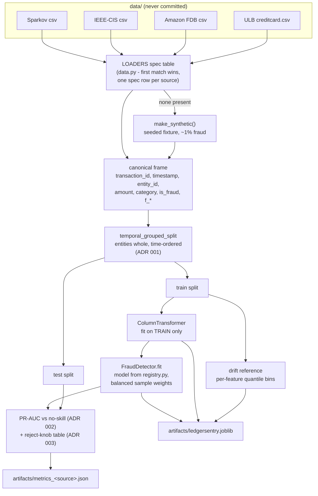
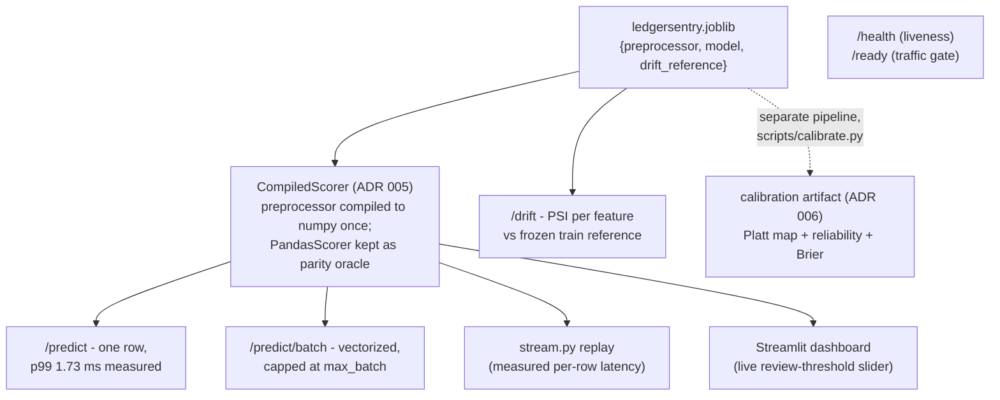

# Architecture

One package, two pipelines (train and serve), three deliberate seams. Decision
records live in `docs/adr/`; the cuts - what was considered and rejected as
speculative - are in [ADR 004](adr/004-serving-shape.md) and matter as much as
what shipped.

## Training pipeline



## Serving pipeline



## The three seams (each has >= 2 real implementations today)

| Seam | Contract | Implementations in this repo |
|---|---|---|
| Data source | `LoaderSpec` + `LoaderFn` protocol (data.py) | Sparkov, IEEE-CIS, Amazon FDB, ULB (+ synthetic fallback) |
| Classifier | registry factory (registry.py) | `hist_gbdt`, `logreg` (a test registers a third at runtime to prove the seam) |
| Scoring path | `TransactionScorer` protocol (scoring.py) | `CompiledScorer` (serving), `PandasScorer` (reference + benchmark baseline) |

That "two real implementations" bar is the repo's rule for abstractions: a seam
with one implementer is speculation, and several candidates failed the bar and
were cut by name (feature-pipeline protocol, sink/alert abstraction, plugin
loading - ADR 004).

## Module map

```
src/ledgersentry/
  config.py      pydantic-settings: env > yaml > defaults; defaults = the committed run
  data.py        loaders (spec table), canonical schema, synthetic fixture, the split
  registry.py    model registry (one register() call to add a classifier)
  model.py       FraudDetector + reject knob + curve/expected-cost math
  scoring.py     TransactionScorer protocol, compiled + reference scorers
  train.py       load -> split -> fit -> evaluate -> artifacts (+ drift reference)
  calibration.py Platt/isotonic calibration pipeline (separate from train, ADR 006)
  drift.py       PSI vs frozen training reference
  bench.py       committed latency/throughput harness (writes benchmark.json)
  service.py     FastAPI: predict/batch/drift/health/ready/curve, JSON logs
  stream.py      timestamp-ordered replay of the held-out test split
```
